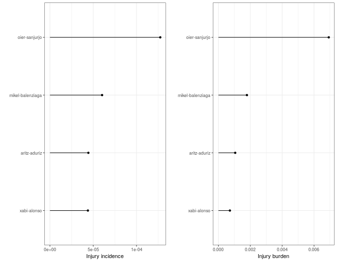

## Overview of injuries


```
## Error: Assertion on 'injd' failed: Must inherit from class 'injd', but has class 'character'.
```

**Cohort overview**


```
## Error in UseMethod("group_by"): no applicable method for 'group_by' applied to an object of class "NULL"
```

```
## Error in UseMethod("select"): no applicable method for 'select' applied to an object of class "NULL"
```

<table>
 <thead>
  <tr>
   <th style="text-align:left;font-weight: bold;"> Total number of players </th>
   <th style="text-align:left;font-weight: bold;"> Total number of players injured (%) </th>
   <th style="text-align:left;font-weight: bold;"> Number of players injury free (%) </th>
  </tr>
 </thead>
<tbody>
  <tr>
   <td style="text-align:left;width: 4.5cm; "> 0 </td>
   <td style="text-align:left;width: 4.5cm; "> 0 (NaN%) </td>
   <td style="text-align:left;width: 4.5cm; "> 0 (NaN%) </td>
  </tr>
</tbody>
</table>

```
## Error in paste0(tot_expo, " (", median_expo_player, ")"): object 'median_expo_player' not found
```

**KONTUZ UNITATEAK: JOKATUTAKO PARTIDETAKO MINUTUAK IZANDA, EGOKIAGOA DA x1000H MODURA EZ ERREPORTATZEA!**


```
## Error: Assertion on 'injd' failed: Must inherit from class 'injd', but has class 'character'.
```

- **Who is the most injured player?**


```
## Error in kable_kable(x = structure(c("aritz-aduriz", "18"), .Dim = 1:2, .Dimnames = list(: could not find function "kable_kable"
```

- **Who is the player with more days lost?**

<table>
 <thead>
  <tr>
   <th style="text-align:left;font-weight: bold;"> Player </th>
   <th style="text-align:right;font-weight: bold;"> Number of days lost </th>
  </tr>
 </thead>
<tbody>
  <tr>
   <td style="text-align:left;"> aritz-aduriz </td>
   <td style="text-align:right;"> 427 </td>
  </tr>
</tbody>
</table>

- **Who is the player with highest injury incidence?**

<table>
 <thead>
  <tr>
   <th style="text-align:left;font-weight: bold;"> Player </th>
   <th style="text-align:right;font-weight: bold;"> Injury incidence </th>
  </tr>
 </thead>
<tbody>
  <tr>
   <td style="text-align:left;"> oier-sanjurjo </td>
   <td style="text-align:right;"> 0.0001275 </td>
  </tr>
</tbody>
</table>

- **Who is the player with highest injury burden?**

<table>
 <thead>
  <tr>
   <th style="text-align:left;font-weight: bold;"> Player </th>
   <th style="text-align:right;font-weight: bold;"> Injury burden </th>
  </tr>
 </thead>
<tbody>
  <tr>
   <td style="text-align:left;"> oier-sanjurjo </td>
   <td style="text-align:right;"> 0.006925 </td>
  </tr>
</tbody>
</table>

"Below, a table showing each player detailed injury summary statistics:"

<table>
 <thead>
  <tr>
   <th style="text-align:left;font-weight: bold;"> Player </th>
   <th style="text-align:right;font-weight: bold;"> Number of injuries </th>
   <th style="text-align:right;font-weight: bold;"> Number of days lost </th>
   <th style="text-align:right;font-weight: bold;"> Total exposure </th>
   <th style="text-align:right;font-weight: bold;"> Injury incidence </th>
   <th style="text-align:right;font-weight: bold;"> Injury burden </th>
  </tr>
 </thead>
<tbody>
  <tr>
   <td style="text-align:left;width: 3cm; "> oier-sanjurjo </td>
   <td style="text-align:right;width: 2.2cm; "> 6 </td>
   <td style="text-align:right;width: 2.2cm; "> 326 </td>
   <td style="text-align:right;width: 2.2cm; "> 47076 </td>
   <td style="text-align:right;width: 2.2cm; "> 0.0001275 </td>
   <td style="text-align:right;width: 2.2cm; "> 0.0069250 </td>
  </tr>
  <tr>
   <td style="text-align:left;width: 3cm; "> mikel-balenziaga </td>
   <td style="text-align:right;width: 2.2cm; "> 13 </td>
   <td style="text-align:right;width: 2.2cm; "> 386 </td>
   <td style="text-align:right;width: 2.2cm; "> 215829 </td>
   <td style="text-align:right;width: 2.2cm; "> 0.0000602 </td>
   <td style="text-align:right;width: 2.2cm; "> 0.0017885 </td>
  </tr>
  <tr>
   <td style="text-align:left;width: 3cm; "> aritz-aduriz </td>
   <td style="text-align:right;width: 2.2cm; "> 18 </td>
   <td style="text-align:right;width: 2.2cm; "> 427 </td>
   <td style="text-align:right;width: 2.2cm; "> 405446 </td>
   <td style="text-align:right;width: 2.2cm; "> 0.0000444 </td>
   <td style="text-align:right;width: 2.2cm; "> 0.0010532 </td>
  </tr>
  <tr>
   <td style="text-align:left;width: 3cm; "> xabi-alonso </td>
   <td style="text-align:right;width: 2.2cm; "> 10 </td>
   <td style="text-align:right;width: 2.2cm; "> 164 </td>
   <td style="text-align:right;width: 2.2cm; "> 227992 </td>
   <td style="text-align:right;width: 2.2cm; "> 0.0000439 </td>
   <td style="text-align:right;width: 2.2cm; "> 0.0007193 </td>
  </tr>
</tbody>
</table>





## Risk matrices


## Availability

## Questions: are there differences regarding age/position/season?
